# Nutrition App

 

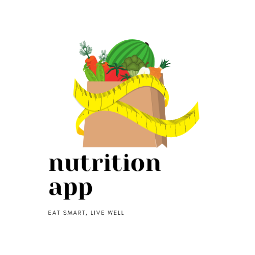 

Melalui kemajuan teknologi mobile dan internet, aplikasi memberikan informasi nutrisi dengan mudah. Penggunaan data dan analitika membantu aplikasi memahami kebiasaan makan pengguna. Dengan fokus pada kesehatan masyarakat, aplikasi nutrisi memiliki potensi besar dalam mempengaruhi kebiasaan makan dan kesehatan secara keseluruhan.

## Kelompok 2

<table border="1">
  <thead>
    <tr>
      <td>No</td>
      <td>NIM</td>
      <td>Nama Anggota</td>
    </tr>
  <thead>
  <tbody>
    <tr>
      <td>1</td>
      <td>15210450</td>
      <td>Alif Firman Hakim</td>
    </tr>
    <tr>
      <td>2</td>
      <td>15220837</td>
      <td>Adinda Febryanty</td>
    </tr>
    <tr>
      <td>3</td>
      <td>15220775</td>
      <td>Bella Azka Oktavia</td>
    </tr>
    <tr>
      <td>4</td>
      <td>15220334</td>
      <td>Noufal Zaidan</td>
    </tr>
  </tbody>
</table>

## 💻 Pengguna Sistem

Pengguna yang dapat memakai sistem ini adalah Admin.

## 👨‍💻 Skenario Kebutuhan Pengguna

### Admin

<ol>
  <li>Admin dapat melakukan login.</li>
  <li>Admin dapat melihat, menambahkan, memperbarui, dan menghapus data Makanan.</li>
  <li>Admin dapat melihat, menambahkan, memperbarui, dan menghapus data Minuman.</li>
  <li>Admin dapat menghitung Kalori Harian.</li>
  <li>Admin dapat menghitung BMI.</li>
</ol>

## 🖼️ Screenshot Aplikasi

<table width="100%">
  <tbody>
    <tr>
      <td width="33%">
        <h5>Splash</h5>
        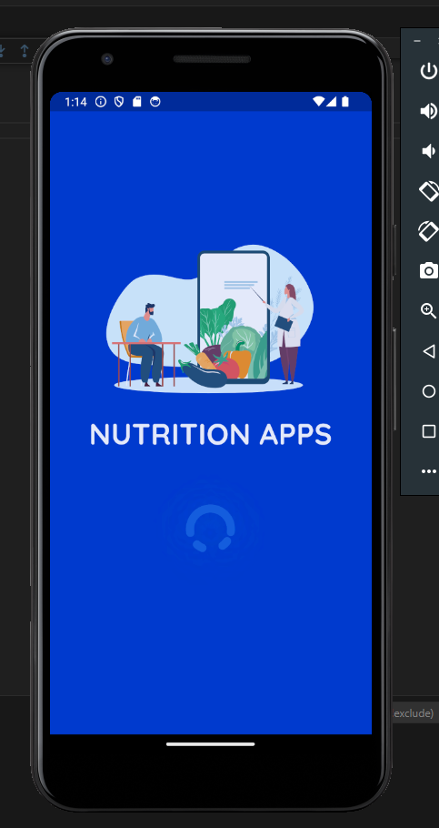 
      </td>
      <td width="33%">
        <h5>Login Form</h5>
        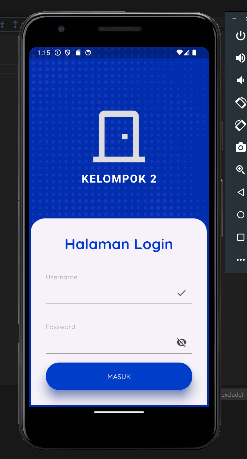
      </td>
      <td width="33%">
        <h5>Alert Login Gagal</h5>
        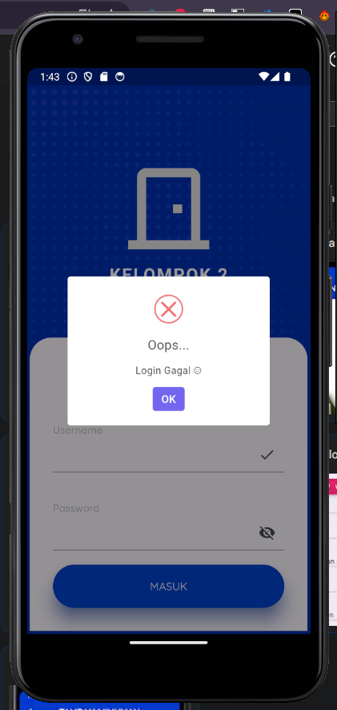
      </td>
    </tr>
  </tbody>
</table>

<table width="100%">
  <tbody>
    <tr>
      <td width="33%">
        <h5>Alert Login Sukses</h5>
        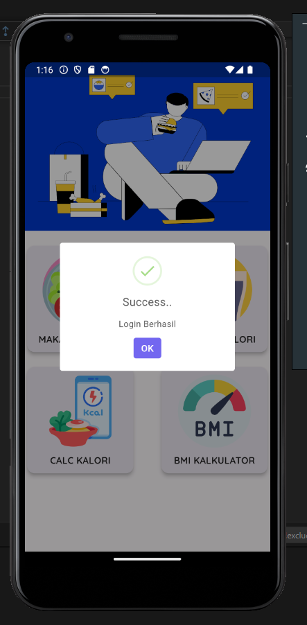 
      </td>
      <td width="33%">
        <h5>Home Page</h5>
        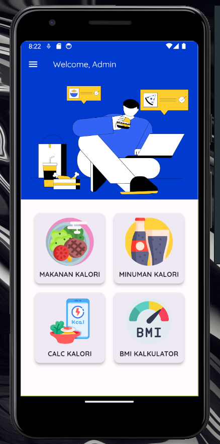
      </td>
      <td width="33%">
        <h5>Sidebar</h5>
        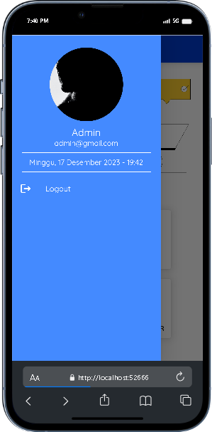
      </td>
    </tr>
  </tbody>
</table>

<table width="100%">
  <tbody>
    <tr>
      <td width="33%">
        <h5>Daftar Makanan</h5>
        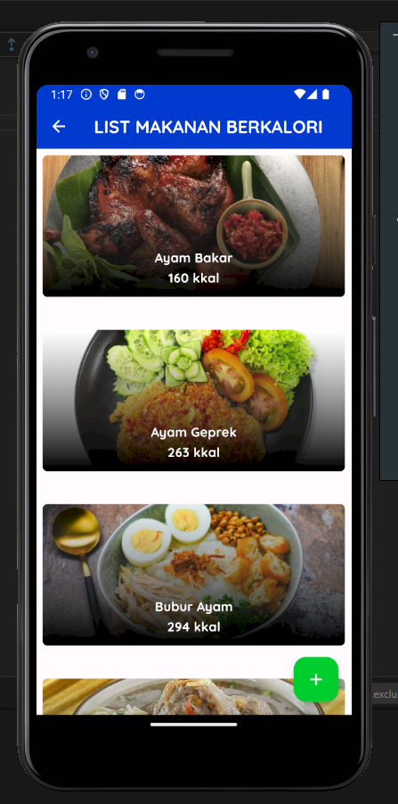 
      </td>
      <td width="33%">
        <h5>Tambah Makanan</h5>
        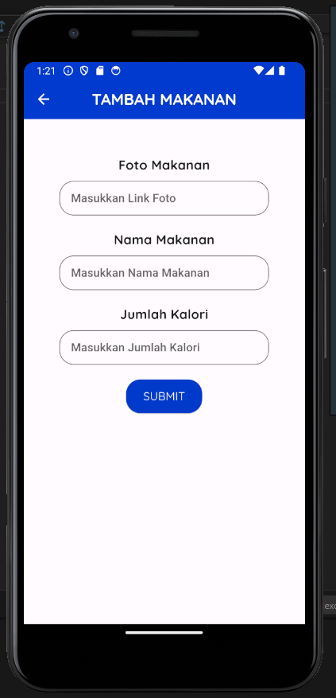
      </td>
      <td width="33%">
        <h5>Detail Makanan</h5>
        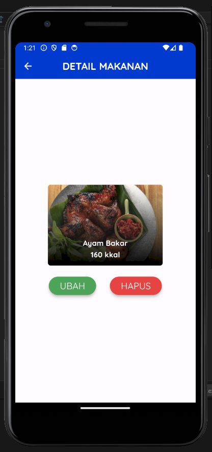
      </td>
      <td width="33%">
        <h5>Edit Makanan</h5>
        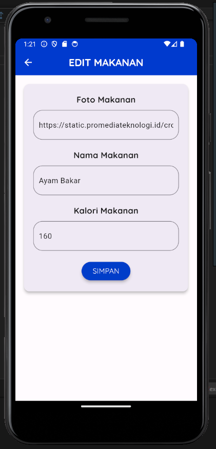
      </td>
    </tr>
  </tbody>
</table>

<table width="100%">
  <tbody>
    <tr>
      <td width="33%">
        <h5>Daftar Minuman</h5>
        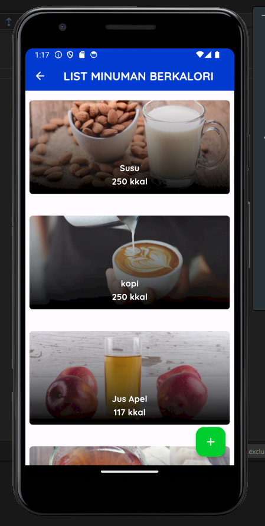 
      </td>
      <td width="33%">
        <h5>Tambah Minuman</h5>
        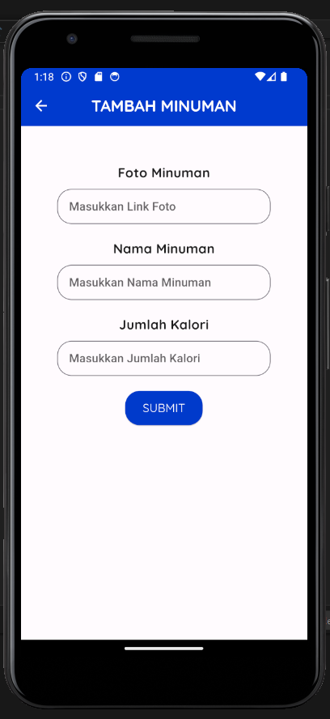
      </td>
      <td width="33%">
        <h5>Detail Minuman</h5>
        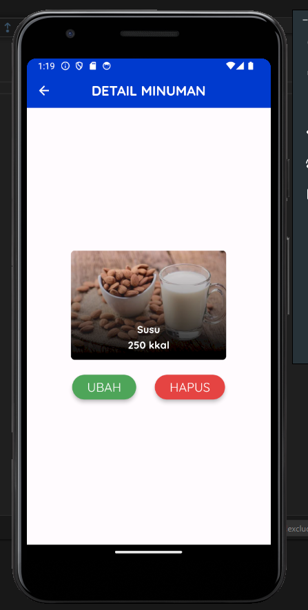
      </td>
      <td width="33%">
        <h5>Edit Minuman</h5>
        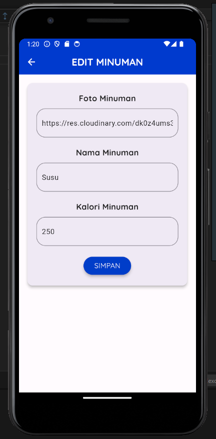
      </td>
    </tr>
  </tbody>
</table>

<table width="100%">
  <tbody>
    <tr>
      <td width="33%">
        <h5>Kalkulator Kalori</h5>
        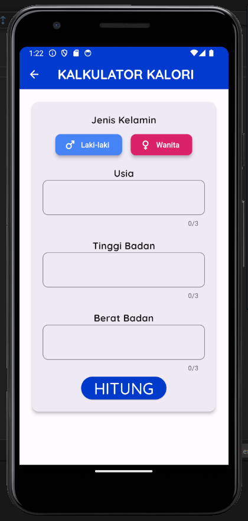 
      </td>
      <td width="33%">
        <h5>Kalori Result</h5>
        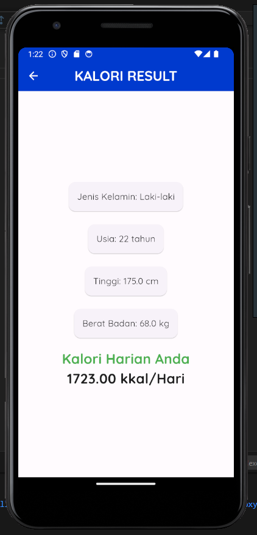
      </td>
    </tr>
  </tbody>
</table>

<table width="100%">
  <tbody>
    <tr>
      <td width="33%">
        <h5>Kalkulator BMI</h5>
        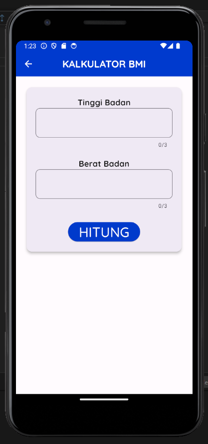 
      </td>
      <td width="33%">
        <h5>BMI Result</h5>
        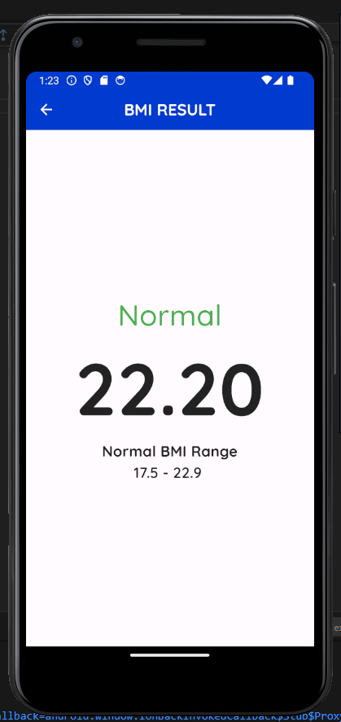
      </td>
    </tr>
  </tbody>
</table>

## 📝 Prerequisite

Untuk menjalankan aplikasi ini disarankan untuk menyiapkan aplikasi berikut ini :

- [x] Android Studio Giraffe <code>2022.03.1 Patch 1</code>
- [x] Flutter <code>3.13.2</code>
- [x] Dart <code>3.1.0</code>
- [x] Java JDK <code>19.0.0</code>
- [x] Git <code>2.35.1</code>

## 📝 PPT

Kelompok 2: https://drive.google.com/drive/folders/1Dj4Rd6fzrGFSl7_jE6KYV7BBje1QMHkj?usp=sharing

## Credit

Project ini mengacu pada modul praktik dari mata kuliah Mobile Programming Universitas Bina Sarana Informatika (UBSI) yang diampu oleh Bpk. <a href="https://github.com/yuris60">Yuris Alkhalifi, M.Kom., CPDSA</a> selaku Dosen.

#Nutrition_Apps
